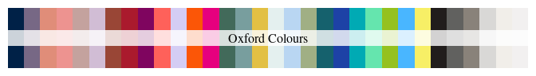
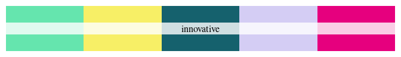
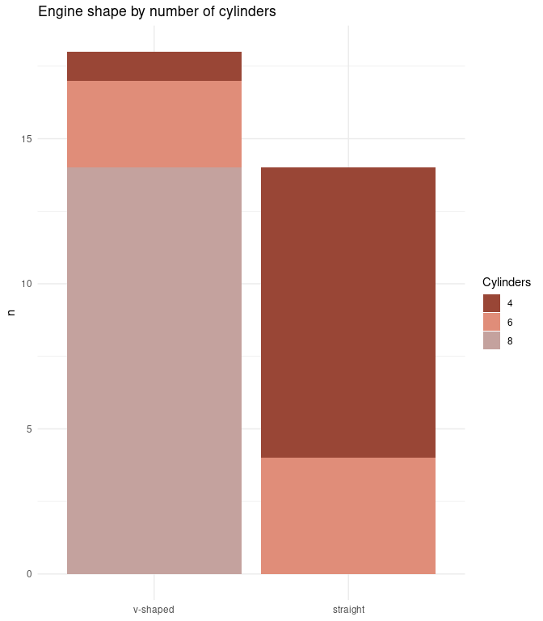
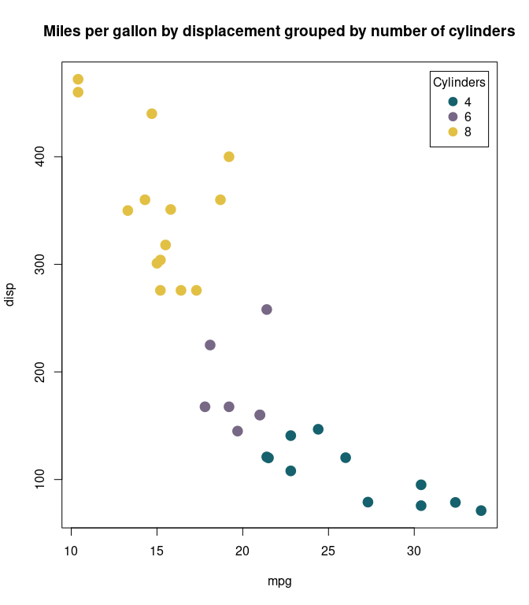
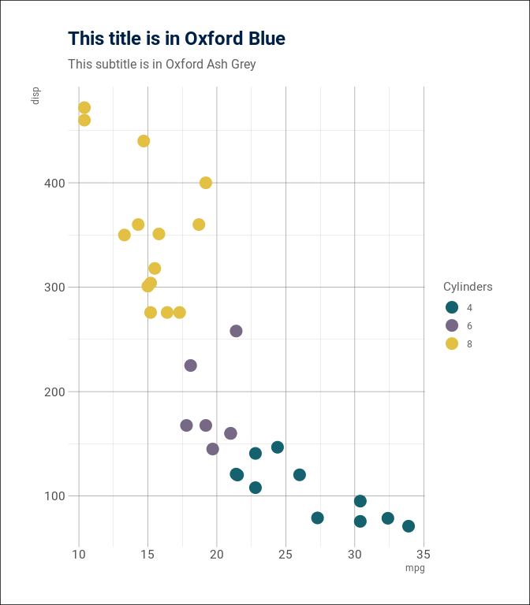
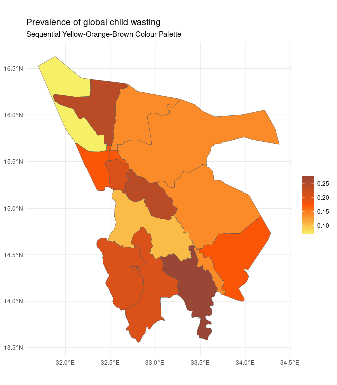
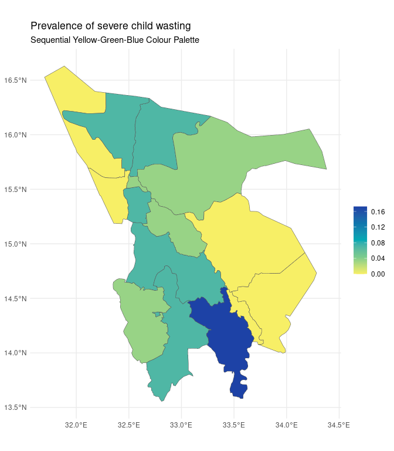
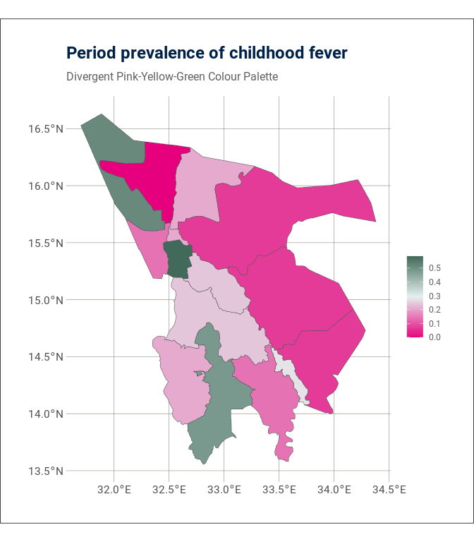
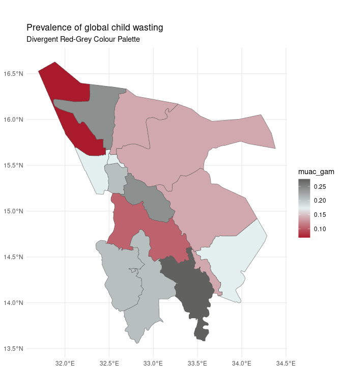

<!-- README.md is generated from README.Rmd. Please edit that file -->

# oxthema: Oxford Palette, Theme, and Theme Components 

<!-- badges: start -->

[](https://www.repostatus.org/#wip)
[](https://lifecycle.r-lib.org/articles/stages.html#experimental)
[](https://github.com/OxfordIHTM/oxthema/actions/workflows/R-CMD-check.yaml)
[](https://github.com/OxfordIHTM/oxthema/actions/workflows/test-coverage.yaml)
[](https://app.codecov.io/gh/OxfordIHTM/oxthema?branch=main)
[](https://www.codefactor.io/repository/github/oxfordihtm/oxthema)
[](https://zenodo.org/doi/10.5281/zenodo.10721129)
<!-- badges: end -->

Palette, theme, and theme components based on [University of
Oxford](https://ox.ac.uk)’s [visual identity
guidelines](https://communications.web.ox.ac.uk/communications-resources/visual-identity/identity-guidelines).

## What does `oxthema` do?

`oxthema` aims to provide templates, themes, and theme components for
colour palettes, typography, and layout compliant with [University of
Oxford](https://ox.ac.uk)’s [visual identity
guidelines](https://communications.web.ox.ac.uk/communications-resources/visual-identity/identity-guidelines)
for use in the R language for statistical computing graphics and
publishing ecosystem.

Currently, the package provides colour palettes consistent with the
colours prescribed by the university visual identity guidelines.
Additional templates, themes, and theme components will be included over
time.

## Installation

`oxthema` is not yet available on [CRAN](https://cran.r-project.org) but
can be installed through the [Oxford IHTM R
universe](https://oxfordihtm.r-universe.dev) repository as follows:

``` r
install.packages(
  "oxthema", 
  repos = c(
    'https://oxfordihtm.r-universe.dev', 
    'https://cloud.r-project.org'
  )
)
```

## Usage

### Oxford colours

Based on the [University of Oxford](https://ox.ac.uk)’s [visual identity
guidelines](https://communications.web.ox.ac.uk/communications-resources/visual-identity/identity-guidelines),
the following colours are available from this package:

| name                 | rgb           | cmyk            | hex      | pantone       |
|:---------------------|:--------------|:----------------|:---------|:--------------|
| Oxford blue          | 0, 33, 71     | 100, 87, 42, 51 | \#002147 | 282           |
| Oxford mauve         | 119, 104, 133 | 58, 60, 27, 10  | \#776885 | 667C          |
| Oxford peach         | 224, 141, 121 | 2, 58, 51, 0    | \#E08D79 | 4051C         |
| Oxford potters pink  | 237, 147, 144 | 0, 57, 34, 0    | \#ED9390 | 2339C         |
| Oxford dusk          | 196, 162, 158 | 20, 40, 31, 5   | \#C4A29E | 6030C         |
| Oxford lilac         | 209, 189, 213 | 18, 30, 4, 0    | \#D1BDD5 | 524C          |
| Oxford sienna        | 153, 70, 54   | 25, 82, 80, 19  | \#994636 | 4036C         |
| Oxford CCB red       | 127, 5, 95    | 48, 100, 19, 15 | \#AA1A2D | 187C          |
| Oxford plum          | 127, 5, 95    | 48, 100, 19, 15 | \#7F055F | 2425C         |
| Oxford coral         | 254, 97, 90   | 0, 79, 56, 0    | \#FE615A | 178C          |
| Oxford lavender      | 212, 205, 244 | 19, 22, 0, 0    | \#D4CDF4 | 2635C         |
| Oxford orange        | 251, 86, 7    | 0, 76, 95, 0    | \#FB5607 | 1655C         |
| Oxford pink          | 230, 0, 126   | 0, 100, 0, 0    | \#E6007E | 2385C         |
| Oxford green         | 66, 106, 90   | 79, 35, 64, 26  | \#426A5A | 5545C         |
| Oxford ocean grey    | 120, 158, 158 | 61, 22, 37, 4   | \#789E9E | 2211C         |
| Oxford yellow ochre  | 226, 192, 68  | 10, 23, 93, 1   | \#E2C044 | 4016C         |
| Oxford cool grey     | 228, 240, 239 | 15, 0, 8, 0     | \#E4F0EF | 7541C         |
| Oxford sky blue      | 185, 214, 242 | 34, 6, 0, 0     | \#B9D6F2 | 277C          |
| Oxford sage green    | 160, 175, 132 | 45, 19, 58, 3   | \#A0AF84 | 7494C         |
| Oxford viridian      | 21, 97, 109   | 92, 36, 43, 27  | \#15616D | 5473C         |
| Oxford royal blue    | 29, 66, 166   | 96, 75, 0, 0    | \#1D42A6 | 2126C         |
| Oxford aqua          | 0, 170, 180   | 84, 0, 33, 0    | \#00AAB4 | 7710C         |
| Oxford vivid green   | 101, 229, 174 | 56, 0, 46, 0    | \#65E5AE | 3385C         |
| Oxford lime green    | 149, 193, 31  | 54, 0, 100, 0   | \#95C11F | 2292C         |
| Oxford cerulean blue | 73, 182, 255  | 68, 11, 0, 0    | \#49B6FF | 292C          |
| Oxford lemon yellow  | 247, 239, 102 | 8, 0, 69, 0     | \#F7EF66 | 3935C         |
| Oxford charcoal      | 33, 29, 28    | 70, 67, 61, 81  | \#211D1C | 419 C         |
| Oxford ash grey      | 97, 97, 95    | 57, 46, 48, 36  | \#61615F | 6215 C        |
| Oxford umber         | 137, 130, 122 | 43, 39, 43, 22  | \#89827A | 403 C         |
| Oxford stone grey    | 217, 216, 214 | 17, 13, 15, 0   | \#D9D8D6 | Cool Gray 1 C |
| Oxford shell grey    | 241, 238, 233 | 6, 6, 9, 0      | \#F1EEE9 | Warm Gray 1 C |
| Oxford off white     | 242, 240, 240 | 6, 6, 6, 0      | \#F2F0F0 | 663 C         |
| Gold                 |               |                 |          | 10122C        |
| Silver               |               |                 |          | 10103C        |



You can access either the name, RGB, CMYK, hex code, and/or Pantone
values of each Oxford colour through the `get_oxford_colours()` function
as follows:

``` r
## Get hex code for Oxford blue
get_oxford_colours(pattern = "Oxford blue")
#> [1] "#002147"

## Get hex code for all colours with "blue" in their name (show name in output)
get_oxford_colours(pattern = "blue", named = TRUE)
#>          Oxford blue      Oxford sky blue    Oxford royal blue 
#>            "#002147"            "#B9D6F2"            "#1D42A6" 
#> Oxford cerulean blue 
#>            "#49B6FF"
```

The `get_oxford_colours()` function can thus be used to create your own
bespoke combination of colours from the Oxford colours palette and
create your own theme (see next section for University of Oxford
officially recommended themes using the Oxford colours).

### Oxford palettes

Based on the [University of Oxford](https://ox.ac.uk)’s [visual identity
guidelines](https://communications.web.ox.ac.uk/communications-resources/visual-identity/identity-guidelines)
and the carefully curated colour groups of the official University
[theme
packs](https://communications.web.ox.ac.uk/communications-resources/visual-identity/identity-guidelines/theme-packs),
the following palettes are available from this package:

#### Heritage

``` r
oxford_theme_palettes()$heritage
#> [1] "#994636" "#E08D79" "#C4A29E" "#A0AF84" "#426A5A"
```


#### Contemporary

``` r
oxford_theme_palettes()$contemporary
#> [1] "#FE615A" "#ED9390" "#E4F0EF" "#789E9E" "#00AAB4"
```


#### Celebratory

``` r
oxford_theme_palettes()$celebratory
#> [1] "#15616D" "#776885" "#E2C044" "#D4CDF4" "#7F055F"
```


#### Corporate

``` r
oxford_theme_palettes()$corporate
#> [1] "#FB5607" "#B9D6F2" "#95C11F" "#49B6FF" "#1D42A6"
```


#### Innovative

``` r
oxford_theme_palettes()$innovative
#> [1] "#65E5AE" "#F7EF66" "#15616D" "#D4CDF4" "#E6007E"
```



### Oxford theme palettes for use in plotting

The University of Oxford recommended theme palettes can be used for
plotting. Below is code examples of how this can be done both with base
R plotting function and with `ggplot2`.

#### Bar plots in base R and using `ggplot`

``` r
## Barplot of cyl and vs of mtcars dataset using heritage Oxford theme

### Base R
table(mtcars$cyl, mtcars$vs) |>
  barplot(
    names.arg = c("v-shaped", "straight"),
    main = "Engine shape by number of cylinders",
    ylab = "n",
    legend.text = TRUE,
    col = oxford_theme_palettes()$heritage,
    args.legend = list(
      x = "topright",
      inset = 0.002,
      title = "Cylinders",
      bty = "n"
    )
  )

### ggplot2
ggplot(
  data = mtcars, 
  mapping = aes(
      x = factor(vs, levels = c(0, 1), labels = c("v-shaped", "straight")), 
      fill = factor(cyl)
    )  
  ) +
  geom_bar() +
  scale_fill_manual(name = "Cylinders", values = oxford_theme_palettes()$heritage) +
  labs(
    title = "This title is in Oxford Blue",
    subtitle = "This subtitle is in Oxford ash grey",
    x = "Engine shape",
    y = "Counts"
  ) +
  theme_oxford()
```



#### Scatter plots in base R and using `ggplot`

``` r
## Scatterplot of mpg and disp of mtcars dataset using celebratory Oxford theme

### Base R
plot(
  x = mtcars$mpg, 
  y = mtcars$disp, 
  pch = 19, cex = 1.75, 
  col = ifelse(
    mtcars$cyl == 4, oxford_theme_palettes()$celebratory[1],
    ifelse(
      mtcars$cyl == 6, oxford_theme_palettes()$celebratory[2],
      oxford_theme_palettes()$celebratory[3]
    )
  ),
  main = "mpg by disp grouped by cyl",
  xlab = "mpg", ylab = "disp",
  frame.plot = FALSE
)
legend(
  x = "topright", inset = 0.02,
  title = "Cylinders",
  legend = c("4", "6", "8"),
  pch = 19, pt.cex = 1.5, bty = "n",
  col = oxford_theme_palettes()$celebratory[1:3]
)

### ggplot2
ggplot(data = mtcars, mapping = aes(x = mpg, y = disp, colour = factor(cyl))) +
  geom_point(size = 5) +
  scale_colour_manual(
    name = "Cylinders", 
    values = oxford_theme_palettes()$celebratory
  ) +
  labs(
    title = "This title is in Oxford Blue",
    subtitle = "This subtitle is in Oxford Ash Grey"
  ) +
  theme_oxford()
```



#### Plotting maps using Oxford palettes

``` r
## Plot acute malnutrition using Oxford sequential palette

### Yellow-Orange-Brown
ggplot(data = nut_survey_map) +
  geom_sf(mapping = aes(fill = muac_mam)) +
  scale_fill_gradientn(
    name = "",
    colours = create_palette_sequential(n = 9, name = "ylorbr")
  ) +
  labs(
    title = "Prevalence of moderate child wasting",
    subtitle = "Sequential Yellow-Orange-Brown Colour Palette"
  ) +
  theme_oxford()

### Yellow-Green-Blue
ggplot(data = nut_survey_map) +
  geom_sf(mapping = aes(fill = muac_sam)) +
  scale_fill_gradientn(
    name = "",
    colours = create_palette_sequential(n = 9, name = "ylgnbu")
  ) +
  labs(
    title = "Prevalence of severe child wasting",
    subtitle = "Sequential Yellow-Green-Blue Colour Palette"
  ) +
  theme_oxford()
```



``` r
## Plot period prevalence of fever and diarrhoea using Oxford divergent palette

### Pink-Yellow-Green
ggplot(data = nut_survey_map) +
  geom_sf(mapping = aes(fill = fev)) +
  scale_fill_gradientn(
    name = "",
    colours = create_palette_divergent(n = 11, name = "piylgn")
  ) +
  labs(
    title = "Period prevalence of childhood fever",
    subtitle = "Divergent Pink-Yellow-Green Colour Palette"
  ) +
  theme_oxford()

### Purple-Green
ggplot(data = nut_survey_map) +
  geom_sf(mapping = aes(fill = dia)) +
  scale_fill_gradientn(
    name = "",
    colours = create_palette_divergent(n = 11, name = "prgn")
  ) +
  labs(
    title = "Period prevalence of childhood diarrhoea",
    subtitle = "Divergent Purple-Green Colour Palette"
  ) +
  theme_oxford()
```



## Authors

- [Ernest Guevarra](https://github.com/ernestguevarra)
- [Greco Malijan](https://github.com/grecomalijan)

## Community guidelines

Feedback, bug reports and feature requests are welcome; file issues or
seek support [here](https://github.com/OxfordIHTM/oxthema/issues). If
you would like to contribute to the package, please see our
[contributing
guidelines](https://oxford-ihtm.io/oxthema/CONTRIBUTING.html).

This project is released with a [Contributor Code of
Conduct](https://oxford-ihtm.io/oxthema/CODE_OF_CONDUCT.html). By
participating in this project you agree to abide by its terms.
