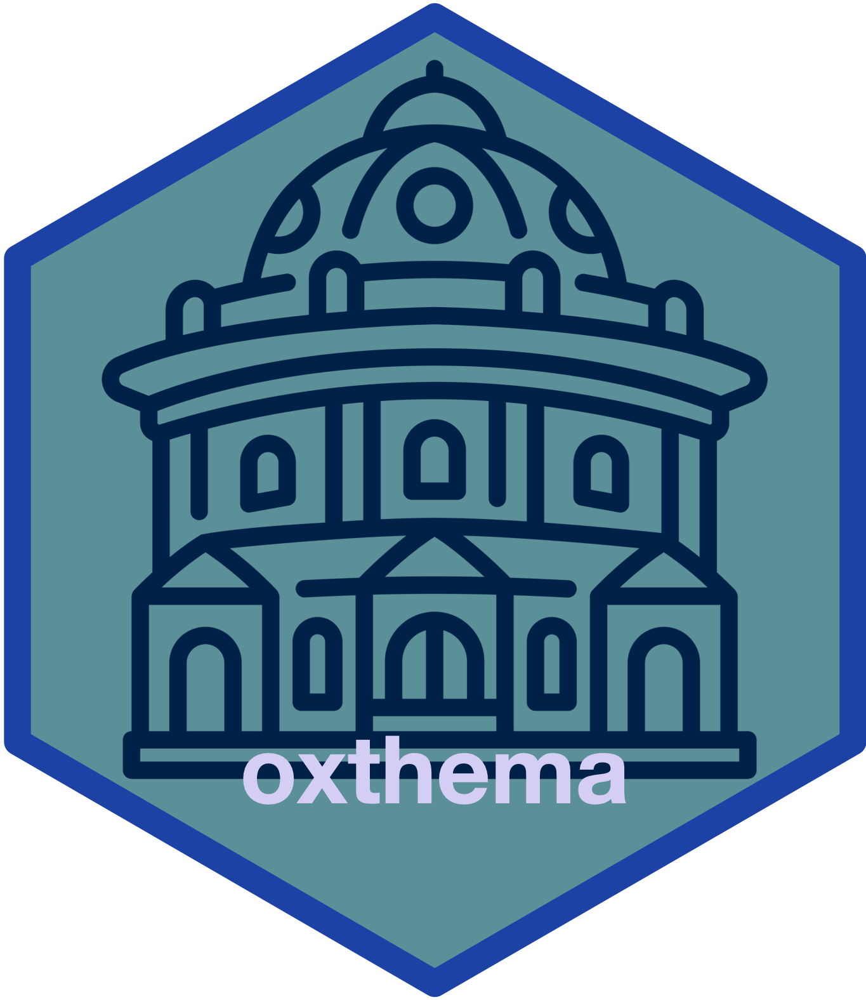

<!-- README.md is generated from README.Rmd. Please edit that file -->

# oxthema: Oxford Colours, Palettes, Fonts, and Themes 

<!-- badges: start -->

[](https://www.repostatus.org/#active)
[](https://lifecycle.r-lib.org/articles/stages.html#stable)
[](https://github.com/OxfordIHTM/oxthema/actions/workflows/R-CMD-check.yaml)
[](https://github.com/OxfordIHTM/oxthema/actions/workflows/test-coverage.yaml)
[](https://app.codecov.io/gh/OxfordIHTM/oxthema?branch=main)
[](https://www.codefactor.io/repository/github/oxfordihtm/oxthema)
[](https://zenodo.org/doi/10.5281/zenodo.10721129)
<!-- badges: end -->

Colours, palettes, fonts, and themes based on [University of
Oxford](https://ox.ac.uk)’s [visual identity
guidelines](https://communications.web.ox.ac.uk/communications-resources/visual-identity/identity-guidelines).

## What does `oxthema` do?

`oxthema` aims to provide templates, themes, and theme components for
colour palettes, typography, and layout compliant with [University of
Oxford](https://ox.ac.uk)’s [visual identity
guidelines](https://communications.web.ox.ac.uk/communications-resources/visual-identity/identity-guidelines)
for use in the R language for statistical computing graphics and
publishing ecosystem.

The package provides colours, palettes, and fonts consistent with the
university visual identity guidelines. The package also includes themes
for specific packages and functionalities that make use of colours,
palettes, and fonts. The package currently has themes for `ggplot2` and
for `forestploter` packages.

## Installation

`oxthema` is not yet available on [CRAN](https://cran.r-project.org) but
can be installed through the [Oxford IHTM R
universe](https://oxfordihtm.r-universe.dev) repository as follows:

``` r
install.packages(
  "oxthema", 
  repos = c(
    'https://oxfordihtm.r-universe.dev', 
    'https://cloud.r-project.org'
  )
)
```

## Usage

The following vignettes provide details on how to make full use of the
`oxthema` package:

- [Oxford
  colours](https://oxford-ihtm.io/oxthema/articles/oxford-colours.html)

- [Oxford
  palettes](https://oxford-ihtm.io/oxthema/articles/oxford-palettes.html)

- [Oxford
  fonts](https://oxford-ihtm.io/oxthema/articles/oxford-fonts.html)

- [Oxford ggplot2
  themes](https://oxford-ihtm.io/oxthema/articles/oxford-ggplot2-themes.html)

- [Oxford forestploter
  themes](https://oxford-ihtm.io/oxthema/articles/oxford-forestploter-themes.html)

## Authors

- [Ernest Guevarra](https://github.com/ernestguevarra)
- [Greco Malijan](https://github.com/grecomalijan)

## Community guidelines

Feedback, bug reports and feature requests are welcome; file issues or
seek support [here](https://github.com/OxfordIHTM/oxthema/issues). If
you would like to contribute to the package, please see our
[contributing
guidelines](https://oxford-ihtm.io/oxthema/CONTRIBUTING.html).

This project is released with a [Contributor Code of
Conduct](https://oxford-ihtm.io/oxthema/CODE_OF_CONDUCT.html). By
participating in this project you agree to abide by its terms.
