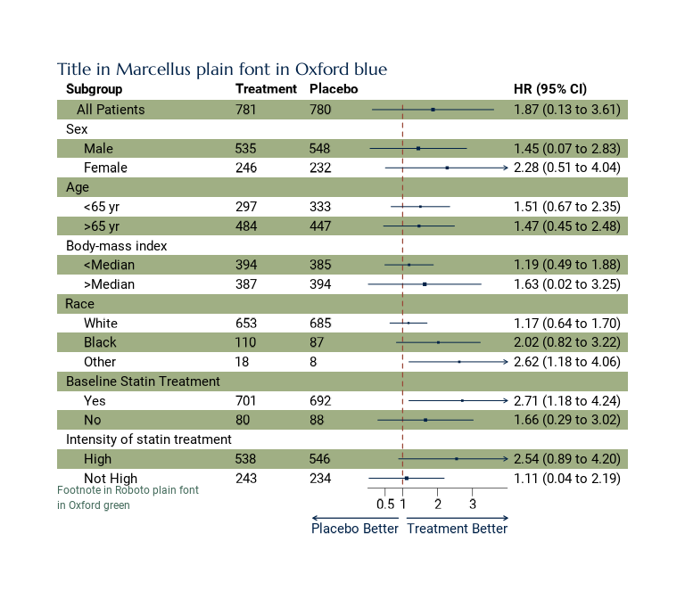

# Oxford forestploter Themes

## Oxford theme for `forestploter` package

Using the example data in the `forestploter` and processing it in the
same way as show in the `forestploter` README as per code below:

``` r
# Read and process example data from forestploter package

## Read example data from forestploter package
dt <- read.csv("https://raw.githubusercontent.com/adayim/forestploter/main/inst/extdata/example_data.csv")

## Indent the subgroup if there is a number in the placebo column
dt$Subgroup <- ifelse(
  is.na(dt$Placebo), dt$Subgroup, paste0("   ", dt$Subgroup)
)

## NA to blank
dt$Treatment <- ifelse(is.na(dt$Treatment), "", dt$Treatment)
dt$Placebo   <- ifelse(is.na(dt$Placebo), "", dt$Placebo)
dt$se        <- (log(dt$hi) - log(dt$est)) / 1.96

## Add a blank column for the forest plot to display CI.
## Adjust the column width with space. 
dt$` ` <- paste(rep(" ", 20), collapse = " ")

## Create confidence interval column to display
dt$`HR (95% CI)` <- ifelse(
  is.na(dt$se), "",
  sprintf("%.2f (%.2f to %.2f)", dt$est, dt$low, dt$hi)
)
```

we demonstrate how to use the based
[`theme_oxford_forest()`](https://oxford-ihtm.io/oxthema/reference/theme_forest.md)
to provide a custom theme to a `forestploter` forest plot as follows:

``` r
# Create forest plot from dt and then apply theme_oxford_forest()

## Create forest plot
p <- forest(dt[ , c(1:3, 20:21)],
            est = dt$est,
            lower = dt$low, 
            upper = dt$hi,
            sizes = dt$se,
            ci_column = 4,
            ref_line = 1,
            arrow_lab = c("Placebo Better", "Treatment Better"),
            xlim = c(0, 4),
            ticks_at = c(0.5, 1, 2, 3),
            title = "Title in Roboto plain font in Oxford blue",
            footnote = "Footnote in Roboto plain font\nin Oxford royal blue",
            theme = theme_oxford_forest())

## Print plot
plot(p)
```

    #> refline_lwd, refline_col will be deprecated, use refline_gp instead.
    #> footnote_cex, footnote_fontface, footnote_col will be deprecated, use footnote_gp instead.
    #> title_col, title_fontfamily will be deprecated, use title_gp instead.
    #> arrow_lwd, arrow_fill, arrow_col will be deprecated, use arrow_gp instead.


### Using Oxford heritage forest plot theme

Using the same example data, we use the
[`theme_heritage_forest()`](https://oxford-ihtm.io/oxthema/reference/theme_forest.md)
to theme the output forest plot as follows:

``` r
# Create forest plot from dt and then apply theme_heritage_forest()

## Create forest plot
p <- forest(dt[ , c(1:3, 20:21)],
            est = dt$est,
            lower = dt$low, 
            upper = dt$hi,
            sizes = dt$se,
            ci_column = 4,
            ref_line = 1,
            arrow_lab = c("Placebo Better", "Treatment Better"),
            xlim = c(0, 4),
            ticks_at = c(0.5, 1, 2, 3),
            title = "Title in Marcellus plain font in Oxford blue",
            footnote = "Footnote in Roboto plain font\nin Oxford green",
            theme = theme_heritage_forest())

## Print plot
plot(p)
```

    #> refline_lwd, refline_col will be deprecated, use refline_gp instead.
    #> footnote_cex, footnote_fontface, footnote_col will be deprecated, use footnote_gp instead.
    #> title_col, title_fontfamily will be deprecated, use title_gp instead.
    #> arrow_lwd, arrow_fill, arrow_col will be deprecated, use arrow_gp instead.



### Using Oxford contemporary forest plot theme

Using the same example data, we use the
[`theme_contemporary_forest()`](https://oxford-ihtm.io/oxthema/reference/theme_forest.md)
to theme the output forest plot as follows:

``` r
# Create forest plot from dt and then apply theme_contemporary_forest()

## Create forest plot
p <- forest(dt[ , c(1:3, 20:21)],
            est = dt$est,
            lower = dt$low, 
            upper = dt$hi,
            sizes = dt$se,
            ci_column = 4,
            ref_line = 1,
            arrow_lab = c("Placebo Better", "Treatment Better"),
            xlim = c(0, 4),
            ticks_at = c(0.5, 1, 2, 3),
            title = "Title in Montserrat plain font in Oxford blue",
            footnote = "Footnote in Roboto plain font\nin Oxford aqua",
            theme = theme_contemporary_forest())

## Print plot
plot(p)
```

    #> refline_lwd, refline_col will be deprecated, use refline_gp instead.
    #> footnote_cex, footnote_fontface, footnote_col will be deprecated, use footnote_gp instead.
    #> title_col, title_fontfamily will be deprecated, use title_gp instead.
    #> arrow_lwd, arrow_fill, arrow_col will be deprecated, use arrow_gp instead.


### Using Oxford celebratory forest plot theme

Using the same example data, we use the
[`theme_celebratory_forest()`](https://oxford-ihtm.io/oxthema/reference/theme_forest.md)
to theme the output forest plot as follows:

``` r
# Create forest plot from dt and then apply theme_celebratory_forest()

## Create forest plot
p <- forest(dt[ , c(1:3, 20:21)],
            est = dt$est,
            lower = dt$low, 
            upper = dt$hi,
            sizes = dt$se,
            ci_column = 4,
            ref_line = 1,
            arrow_lab = c("Placebo Better", "Treatment Better"),
            xlim = c(0, 4),
            ticks_at = c(0.5, 1, 2, 3),
            title = "Title in Noto Serif Display plain font in Oxford blue",
            footnote = "Footnote in Roboto plain font\nin Oxford viridian",
            theme = theme_celebratory_forest())

## Print plot
plot(p)
```

    #> refline_lwd, refline_col will be deprecated, use refline_gp instead.
    #> footnote_cex, footnote_fontface, footnote_col will be deprecated, use footnote_gp instead.
    #> title_col, title_fontfamily will be deprecated, use title_gp instead.
    #> arrow_lwd, arrow_fill, arrow_col will be deprecated, use arrow_gp instead.


### Using Oxford corporate forest plot theme

Using the same example data, we use the
[`theme_corporate_forest()`](https://oxford-ihtm.io/oxthema/reference/theme_forest.md)
to theme the output forest plot as follows:

``` r
# Create forest plot from dt and then apply theme_corporate_forest()

## Create forest plot
p <- forest(dt[ , c(1:3, 20:21)],
            est = dt$est,
            lower = dt$low, 
            upper = dt$hi,
            sizes = dt$se,
            ci_column = 4,
            ref_line = 1,
            arrow_lab = c("Placebo Better", "Treatment Better"),
            xlim = c(0, 4),
            ticks_at = c(0.5, 1, 2, 3),
            title = "Title in Bebas Neue plain font in Oxford blue",
            footnote = "Footnote in Roboto plain font\nin Oxford royal blue",
            theme = theme_corporate_forest())

## Print plot
plot(p)
```

    #> refline_lwd, refline_col will be deprecated, use refline_gp instead.
    #> footnote_cex, footnote_fontface, footnote_col will be deprecated, use footnote_gp instead.
    #> title_col, title_fontfamily will be deprecated, use title_gp instead.
    #> arrow_lwd, arrow_fill, arrow_col will be deprecated, use arrow_gp instead.


### Using Oxford innovative forest plot theme

Using the same example data, we use the
[`theme_innovative_forest()`](https://oxford-ihtm.io/oxthema/reference/theme_forest.md)
to theme the output forest plot as follows:

``` r
# Create forest plot from dt and then apply theme_innovative_forest()

## Create forest plot
p <- forest(dt[ , c(1:3, 20:21)],
            est = dt$est,
            lower = dt$low, 
            upper = dt$hi,
            sizes = dt$se,
            ci_column = 4,
            ref_line = 1,
            arrow_lab = c("Placebo Better", "Treatment Better"),
            xlim = c(0, 4),
            ticks_at = c(0.5, 1, 2, 3),
            title = "Title in Phudu plain font in Oxford blue",
            footnote = "Footnote in Roboto plain font\nin Oxford viridian",
            theme = theme_innovative_forest())

## Print plot
plot(p)
```

    #> refline_lwd, refline_col will be deprecated, use refline_gp instead.
    #> footnote_cex, footnote_fontface, footnote_col will be deprecated, use footnote_gp instead.
    #> title_col, title_fontfamily will be deprecated, use title_gp instead.
    #> arrow_lwd, arrow_fill, arrow_col will be deprecated, use arrow_gp instead.


