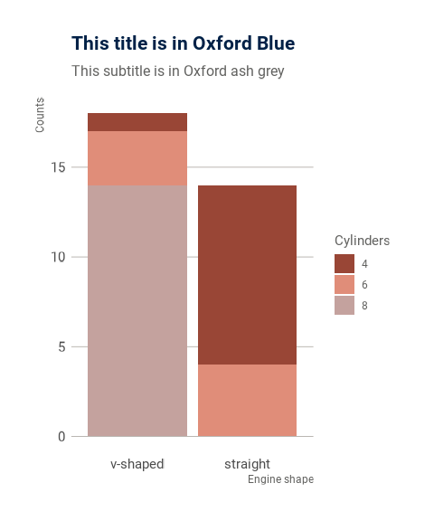
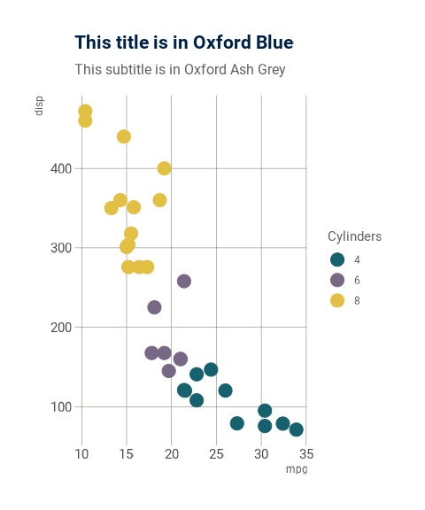
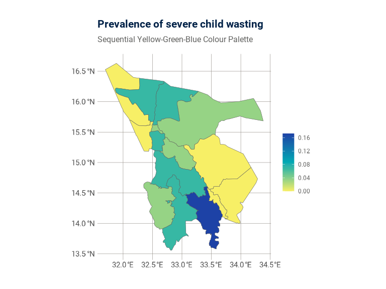
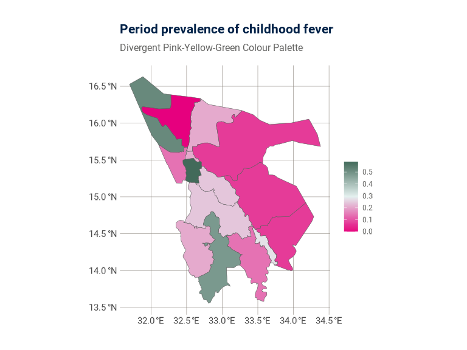
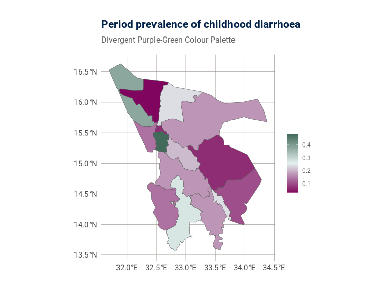

# Oxford ggplot2 Themes

The `oxthema` package has a generic/base `ggplot2` theme which is the
template from which all other themes in the `oxthema` package is/will be
built on. This theme is inspired by Bob Rudis’
[hrbrthemes](https://github.com/hrbrmstr/hrbrthemes) package drawing
heavily on its typography-centric focus. This function uses the *Roboto*
Google font which is the core Oxford san serif font. It is freely
downloadable and easily installed on any system.

## Oxford theme palettes for use in plotting

The University of Oxford recommended theme palettes can be used for
plotting. Below is code examples of how this can be done with `ggplot2`.

### Bar plot

### Scatter plot

### Plotting maps using Oxford palettes

#### Sequential palette

#### Divergent palette

